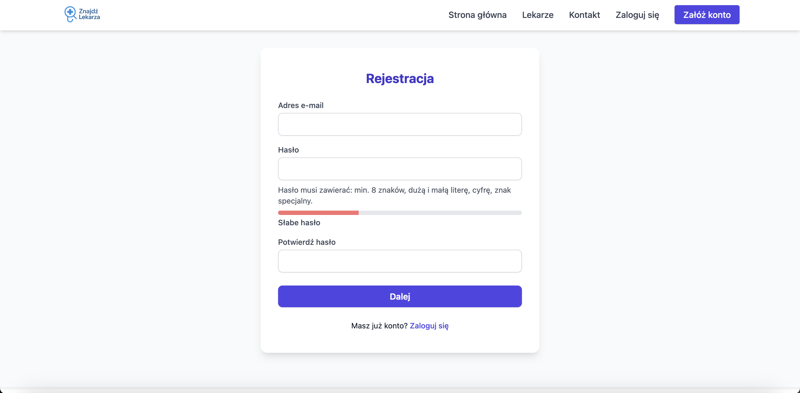
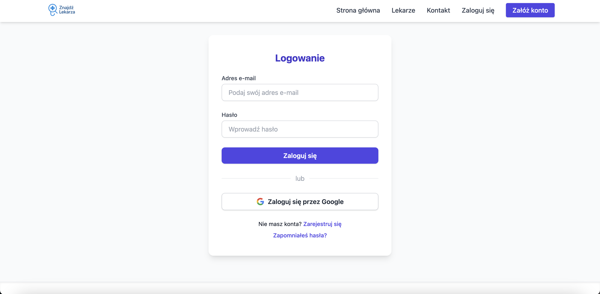
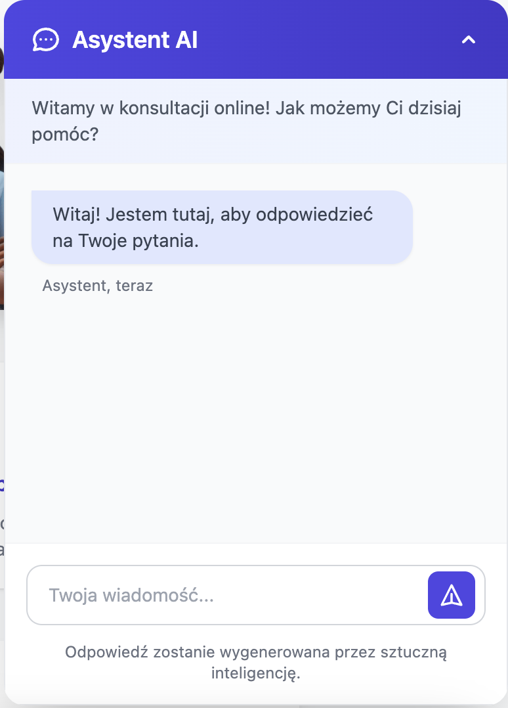
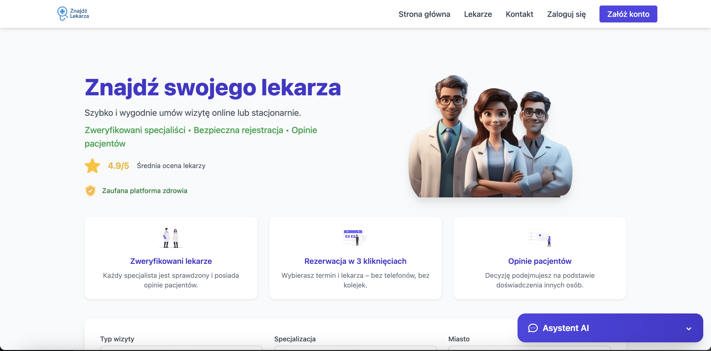
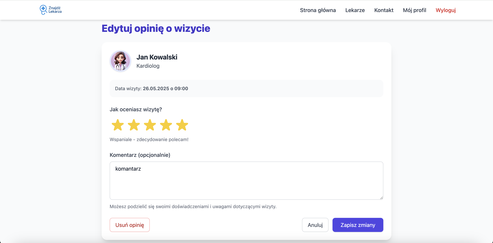
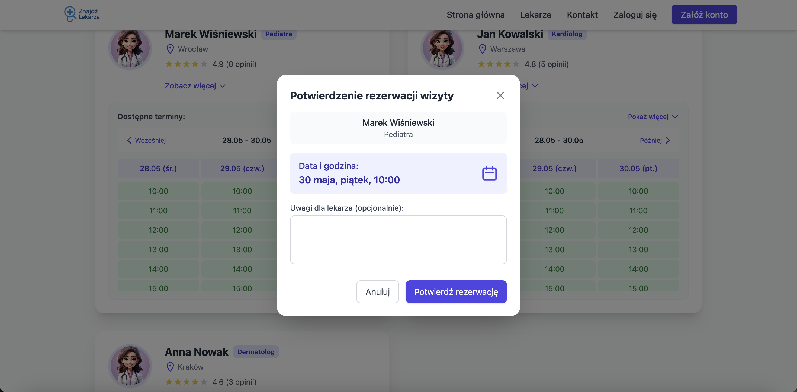
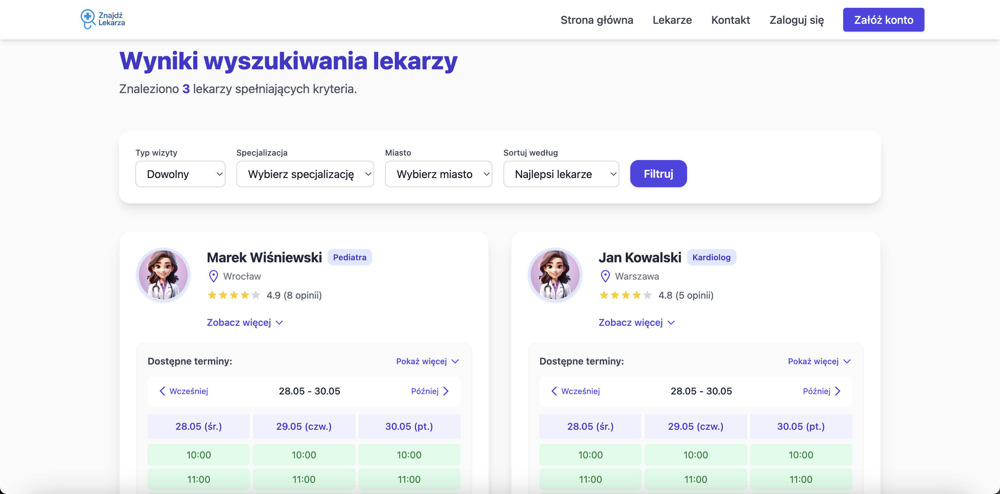

# Sprawozdanie z projektu "Znajdź Lekarza"

## Cel projektu

Celem projektu było stworzenie nowoczesnej aplikacji webowej pozwalającej pacjentom na wyszukiwanie lekarzy według specjalizacji, lokalizacji i dostępności, a także rezerwowanie wizyt online, zarządzanie swoim profilem, ocenianie lekarzy oraz prowadzenie szybkiej komunikacji.

Projekt powstał w ramach przedmiotu _Architektura i komunikacja między systemami i bazami danych_.  
Zrealizowano go w składzie:  
**Siarhei Hratsli (48738), Rafał Dutkiewicz (48725)**

---

## Dowód działania aplikacji – zrzuty ekranu

### 1. Ekran rejestracji użytkownika

Rejestracja wymaga podania adresu e-mail oraz hasła spełniającego wymagania bezpieczeństwa.  

---

### 2. Ekran logowania

Użytkownik może zalogować się przez e-mail i hasło lub skorzystać z logowania przez Google.  

---

### 3. Widżet czatu z asystentem AI

W prawym dolnym rogu strony dostępny jest czat z asystentem — użytkownik może zadawać pytania dotyczące platformy i uzyskiwać szybkie odpowiedzi.  

---

### 4. Strona główna

Strona główna prezentuje najważniejsze funkcjonalności: możliwość szybkiego znalezienia lekarza, rezerwacji wizyty online oraz dostęp do opinii innych pacjentów.  

---

### 5. Edycja opinii o wizycie

Użytkownik może ocenić wizytę u lekarza, dodać komentarz oraz w razie potrzeby usunąć swoją opinię.

---

### 6. Potwierdzenie rezerwacji wizyty

Okno potwierdzenia rezerwacji wizyty umożliwia wybór terminu, wpisanie uwag dla lekarza oraz ostateczne zarezerwowanie wizyty.

---

### 7. Wyniki wyszukiwania lekarzy

System prezentuje znalezionych lekarzy spełniających kryteria wyszukiwania, wraz z ocenami, lokalizacją oraz dostępnymi terminami.

---

### 8. Formularz kontaktowy

Użytkownik ma możliwość bezpośredniego kontaktu z administracją przez przejrzysty formularz.

---

## Najważniejsze funkcje (na podstawie powyższych zrzutów):

- **Rejestracja konta** z walidacją silnego hasła.
- **Logowanie** zarówno klasyczne (e-mail + hasło), jak i przez Google.
- **Czat z asystentem AI** dla szybkiego wsparcia.
- **Przejrzysta strona główna** z informacją o jakości lekarzy oraz prostym wyszukiwaniem.
- **Edycja i wystawianie opinii o wizycie**.
- **Rezerwacja wizyt** z możliwością dodania uwag.
- **Zaawansowane filtrowanie i prezentacja lekarzy**.
- **Formularz kontaktowy** do administracji.

---

## Dodatkowe funkcjonalności projektu

- Po zalogowaniu przez Google, rezerwowane wizyty są automatycznie zapisywane w kalendarzu Google użytkownika.
- System opinii, ocen i zarządzania profilem.
- Wyszukiwanie lekarzy według specjalizacji, miasta i terminu.
- Responsive UI (dzięki Tailwind CSS).

---

## Podsumowanie

Projekt "Znajdź Lekarza" stanowi kompletną platformę do wyszukiwania i rezerwowania wizyt u lekarzy, z nowoczesnym systemem logowania, integracją z Google oraz wsparciem AI.  
Powyższe zrzuty ekranu stanowią dowód działania kluczowych funkcjonalności aplikacji, nawet gdyby kod źródłowy projektu przestał być dostępny.
